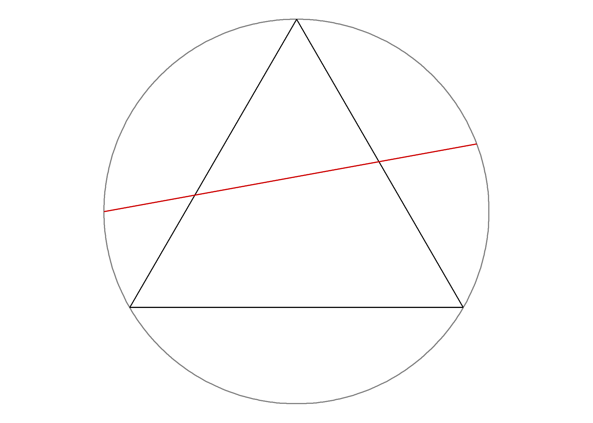

# Bertrand's Paradox

## Problem

> Consider an equilateral triangle inscribed in a circle.
> If a chord in the circle is chosen at random,
> what is the probability, $P$, that the chord, $l$, is longer than a side of the triangle, $s$?

## Solution

There are three possible solutions, which depend on the three different ways of randomly generating a chord. 

- **METHOD A (random endpoints)**: Choose two random points on the circumference of the circle, and draw the chord joining them.

- **METHOD B (random radial points)**: Choose a random radius of the circle, and a random point on this radius, and draw the chord through this point and perpendicular to the radius.

- **METHOD C (random midpoints)**: Choose a point anywhere within the circle, and construct the chord such that the point chosen is the midpoint of the chord.

The three different methods above, all seemingly valid, yield different results for the probability in question! The exact answer can be worked out using geometric reasoning, but the goal of this assignment is to provide a visual and empirical way of calculating the probabilities.

--------------------------------------------------------------------------------
# GetThat° 
Below is a brief explanation of our approaches for each of the methods.
 
 > REMINDER! Before running the codes, do not forget to run all of the `library()` placed at the top of the script. 
 
**Method A (random endpoints)** :
 
 - Firstly, we randomise the angle, $\theta$, in the circle using `runif()` function. Then, determine both endpoints $(x1, y1)$ & $(x2, y2)$ of the random chords. 
 - These coordinates are then tabulated using tibbles. 
 - Using the coordinates, the length of the chords is calculated by the **Distance between 2 points** equation. 
 - The lengths obtained are then compared with the length of the side of the equilateral triangle from the table.
 - For this method, the probability of the length of the chords being longer than the side of the equilateral triangle will be around $1/3$ or $0.3$.

**Method B (random radial points)** :

- First, randomise the angle, $\theta$, and radius *P* of the circle using `runif()` function.
 *Q* is found using **Pythagoras Theorem** $a^2 + b^2 = c^2$.
 - Then, determine both endpoints $(x1, y1)$ & $(x2, y2)$ of the random chords. 
 This [link](https://hpaulkeeler.com/the-bertrand-paradox/) might help in understanding how the x and y values are obtained. 
 - These coordinates are then tabulated using tibbles. 
 - Using the coordinates, the length of the chords is calculated by the **Distance between 2 points** equation. 
 - The lengths obtained are then compared with the length of the side of the equilateral triangle from the table.
 - For this method, the probability of the length of the chords being longer than the side of the equilateral triangle will be around $1/2$ or $0.5$. 
 
**Method C (random midpoints)** :

- Firstly, we randomise the angle, $\theta$, and radius *V* of the circle using `runif()` function. *V1* and *U* is found using **Pythagoras Theorem** $a^2 + b^2 = c^2$.
 - Then, determine both endpoints $(x1, y1)$ & $(x2, y2)$ of the random chords. 
 This [link](https://hpaulkeeler.com/the-bertrand-paradox/) might help in understanding how the x and y values are obtained. 
 - These coordinates are then tabulated using tibbles. 
 - Using the coordinates, the length of the chords is calculated by the **Distance between 2 points** equation. 
 - The lengths obtained are then compared with the length of the side of the equilateral triangle from the table.
 - For this method, the probability of the length of the chords longer than the side of the equilateral triangle will be around $1/4$ or $0.25$. 
 

### Result
 
| Methods     | P(l >s)      |
| :---------: | :---------:  |
| A           | $frac{1}{3}$ |
| B           | $frac{1}{2}$ |
| C           | $frac{1}{4}$ |

--------------------------------------------------------------------------------
- After running the codes, it can be observed that all three methods have different probabilities, depending on how the chord is defined.
- For each of the three methods above, we printed `P(l > s)`, the value of the probability, as the output. These values are calculated using the **Principle of indifference**: $$\Pr(A) = \frac{n(A)}{n(S)}.$$
- The chords plotted in the circle are grouped into two; the **pink** chords represent chords that are **longer** than the side of the equilateral triangle, whereas the **blue** chords represent those that are **shorter**.

### Source
- https://hpaulkeeler.com/the-bertrand-paradox/
- https://www.stewartcalculus.com/data/CALCULUS%20Early%20Transcendentals/upfiles/RotationofAxes.pdf

